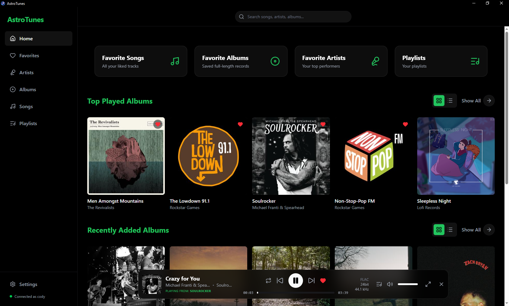

# 🚀 AstroTunes

**Shoot for the stars with your music library.**

AstroTunes is a sleek, lightweight frontend for Subsonic-compatible servers (like Navidrome and Airsonic). While traditional Subsonic interfaces are often "sub"-terranean, we’re taking your music to the stratosphere with a modern, fast, and visually stunning player, available both as a web app and a lightweight desktop application.

## Try it out
You can try out the latest build at [https://codanaut.github.io/AstroTunes/](https://codanaut.github.io/AstroTunes/)

## 🛰️ My Goal
The goal is simple: **Speed, Aesthetics, and Simplicity.**
* **Lightweight:** Built with Svelte and Vite for near-instant load times.
* **Modern UI:** A complete departure from legacy server interfaces, focusing on a "Spotify-esque" dark mode aesthetic.
* **Cross-Platform:** Designed to run perfectly in your browser or as a lightweight desktop app.

## 🛠 Features
* **Full Library Access:** Seamlessly browse your Albums, Artists, and Songs.
* **Smart Playback:** Supports gapless-style streaming via Howler.js with scrobbling support to keep your server stats updated.
* **Real-time Sync:** Automatically syncs your "Favorites and Playlists" across devices.
* **Customizable Views:** Toggle between Grid and List views for your collection.

### 🛰 Coming Features
* **Smart Playlist Creation:** Create Navidrome smart playlists.
* **Custom Theming:** Personalized appearance and accent colors.

## 🧪 Development Status & "Vibe Coding"
This project is currently a **Work in Progress**. 

AstroTunes was partially **vibe coded**. It started as a personal project I was coding myself before I decided to try out Google’s new Antigravity IDE agent manager. Which worked much better than I expected!

**Note:** As the project evolves, the focus is on "de-slopping" the codebase to remove any leftover junk from AI, standardizing functions across Svelte components, and ensuring the architecture is as clean as the UI. Expect frequent changes and potential redesigns!

## 🛰 Tech Stack
* **Framework:** Svelte 5
* **Styling:** Tailwind CSS
* **Icons:** Lucide Svelte
* **Audio:** Howler.js
* **Build Tool:** Vite
* **Desktop App:** Tauri

---
*Built with ❤️ for the self-hosted music community.*